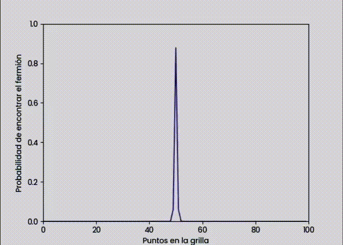
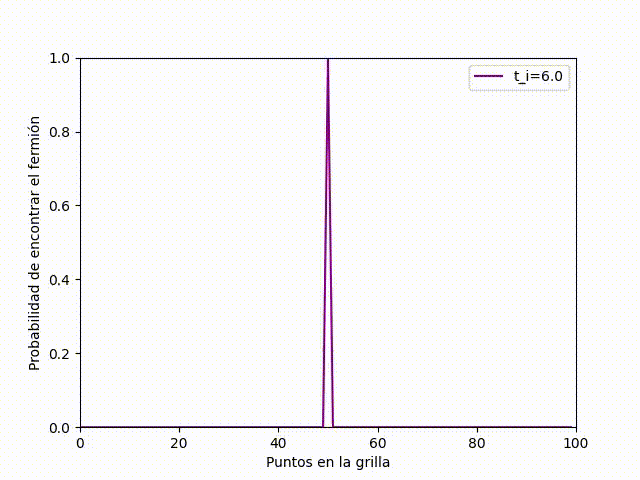
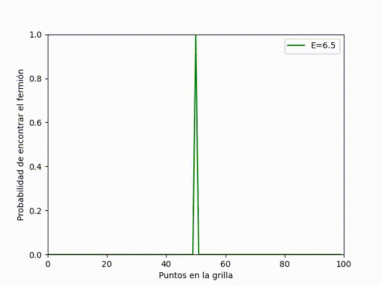
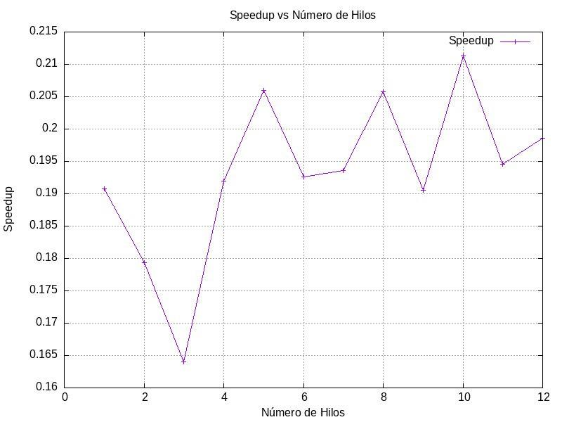

# Planeamiento  y Resultados 

En esta sección se mostraran el planteamiento y los resultados obtenidos de MODELO DE TIGHT BINDING DE OCUPACIÓN SIMPLE CON POTENCIAL DEFINIDO: DINÁMICA.    

## Las dos metodologías que son mejores para implementar la solución numérica.

####  Formal a la ecuación de schrodinger

>  Es una ecuación fundamental en la mecánica cuántica que describe cómo el estado cuántico de un sistema físico cambia con el tiempo. Nos da una representación muy precisa de la evolución temporal de la función de onda.

#### Método de Runge-Kutta 4 Orden (RK4)
>  Mejor compromiso entre complejidad y error de aproximación. Este método es el más utilizado comúnmente para resolver ODEs.Nos permite calcular con precisión la evolución temporal de la función de onda.

## Visualizar su dinámica
##### Probabilidad de encontrar el fermion en una evolución cuántica temporal dentro de una grilla unidimensional.

###### Método de Runge-Kutta de cuarto orden

> Simulación de la evolución temporal de un sistema cuántico utilizando el método de Runge-Kutta de cuarto orden. En la animación, observamos cómo la densidad de probabilidad cambia con el tiempo. Además, se muestra cómo un fermión puede propagarse a través de la grilla mediante la dispersión de la función de onda. Para el modelo que trabajamos que fue el tight binding esta gráfica estaría dándonos la distribución de ocupación de partículas a lo largo de la red.
Los puntos maximos locales de la gráfica, nos estarían dando los sitios preferidos para la ocupación debido a potenciales locales o interacciones específicas que hacen que esos sitios sean energéticamente favorables.
Mientras que los puntos más bajos o mínimos locales en la curva de la gráfica nos indican los sitios con menor probabilidad de encontrar un fermión, ya sea por efectos de repulsión, nodos en la función de onda, o barreras potenciales.
Como la distribución de los picos es iregular  de picos se  puede indicar un desorden en el sistema, por ejemplo defectos en la red.

###### Método Formal a la ecuación de schrodinger

> En la presente animación se se grafíca la norma del operador de destrucción al cuadrado vs el sitio de la grilla i. Para el modelo que trabajamos que fue el tight binding esta gráfica estaría dándonos la estructura de las bandas electrónicas del material. Los picos de la gráfica nos indican un nivel de energía que si está permitido para las partículas en la red. Mientras que los puntos más bajos o mínimos locales en la curva de la gráfica nos indican que hay presencia de bandas prohibidas en el material, es decir donde no hay niveles de energía permitidos. Los cambios abruptos en la gráfica nos podrían indicar transiciones de fase, es decir, donde la estructura de bandas electrónicas cambia significativamente debido a que ocurre variación en ciertos parámetros. Esta animación fue esencial para caracterizar la estructura electrónica de un material en el modelo de tight binding, ya que nos da una representación visual de cómo se distribuyen los estados electrónicos a lo largo de la red.

#### Variación de los parámetros energéticos

###### Variación de parámetro de acoplamiento (t_i)

Este parámetro representa la amplitud de la probabilidad de que un electrón salte de un sitio i a uno adyacente i + 1. 
Este parámetro nos dice el cómo interactúan los fermiones entre los sitios de la grilla y el cómo se propagan los electrones en el sistema.
En la gráfica a continuación, respecto a la primer gráfica, se ha aumentado el valor de este parámetro a t_i = 6.0, al aumentar el parámetro de acoplamiento respecto al original la capacidad del fermión de moverse en la grilla será más rápido, em otras palabras, aumenta la probabilidad de que el electrón salte de un sitio a otro y con ello los fermiones tienen una mayor probabilidad de moverse libremente a través de la red.

###### Variación de energía de sitio (𝜖_i)

Este parámetro representa la energía asociada al sitio i en la grilla, corresponde a la energía del fermión cuando se encuentra en el sitio i. Estas partículas tienden a localizarse más en sitios de mayor energía, lo que provoca una focalización fermiónica y con ello se reduce la movilidad de estas partículas. Como se observa en la gráfica a continuación, la energía de sitio es 𝜖_i = 6.5 , comparado con el 𝜖_i = 0.5 de la primer gráfica este es significativamente mayor. 
Por lo que observando la animación se puede concluir que, en efecto, al aumentar este parámetro los electrones van a focalizarse en los sitios más energéticos y van a reducir su movilidad, lo que resulta en que la probabilidad de los fermiones de pasar de sitio en la grilla se reduzca. Por eso las ondas del gráfico parecen "diluirse" con el paso del tiempo.

 

## Paralelización 
En el gráfico presentado a continuación, observamos cómo la paralelización debería acelerar el proceso de ejecución, ya que el código se divide en múltiples tareas. Sin embargo, en este caso particular, la versión paralelizada fue más lenta. Esto puede deberse a varios factores, como sobrecarga de procesos, problemas de sincronización, o limitaciones de recursos en la computadora.  

